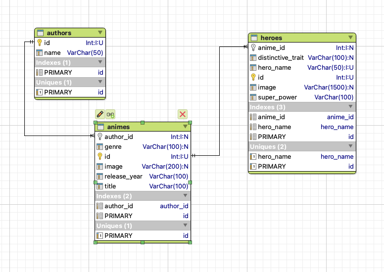
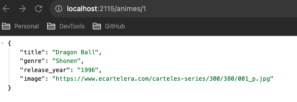
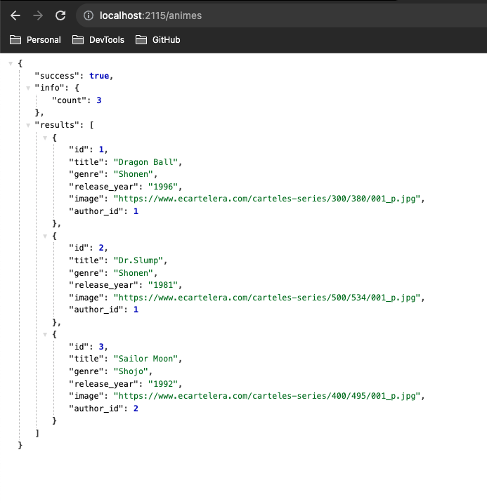
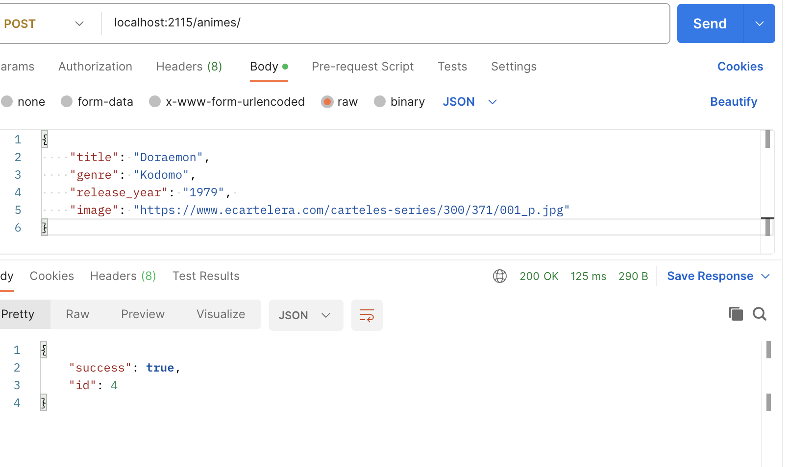
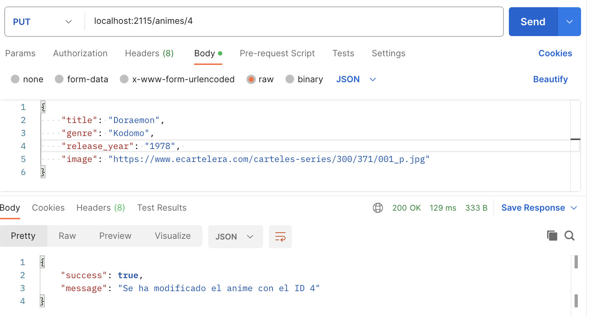
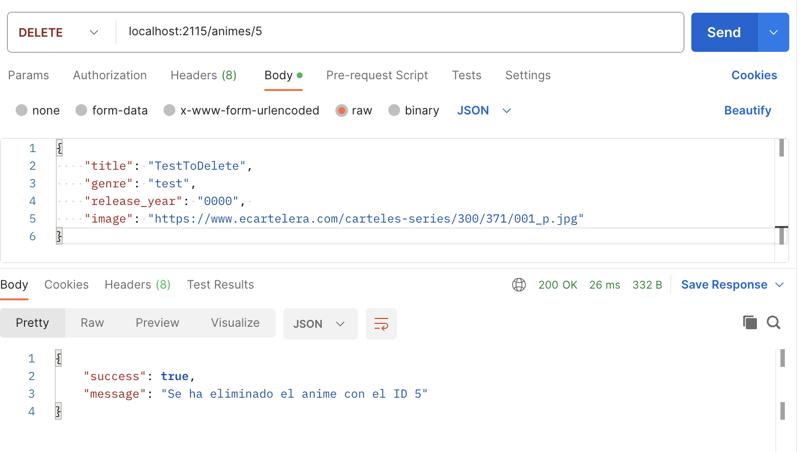
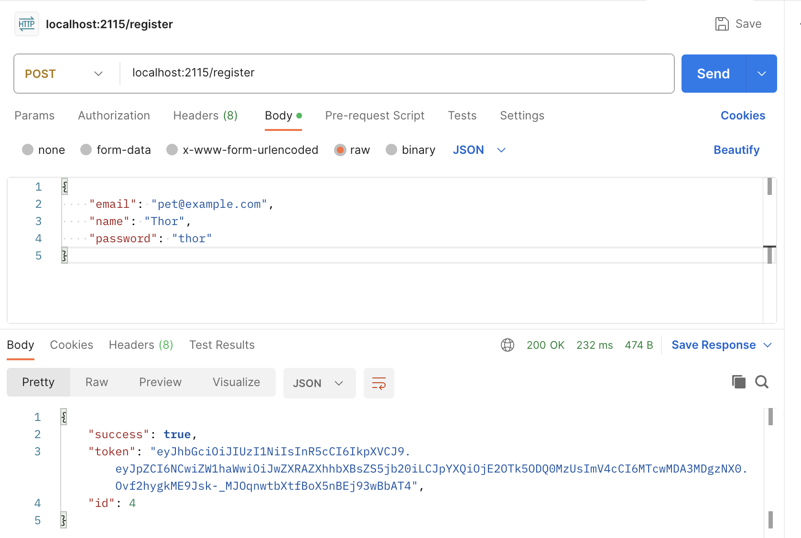
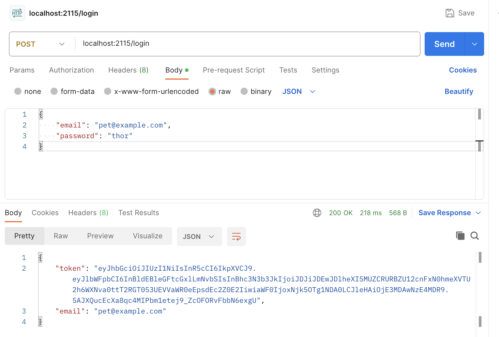

# Evaluación final módulo 4 
Bienvenida/o al ejercicio de evaluación final del módulo 4 de Express JS y bases de datos, hecho por [Silvia Torres](https://www.github.com/Storrecu)

## Objetivo:
El objetivo del ejercicio es diseñar una base de datos mediante MongoDB o MySQL. Establecer relaciones entre las tablas de la base de datos, crear un servidor con Express JS, usar Node.js para el lenguaje del Backend y luego desarrollar una API REST para realizar operaciones CRUD (Crear, Leer, Actualizar, Eliminar) sobre la entidad principal del tema de la base de datos. 
Posteriormente, se prueba la funcionalidad de la API utilizando POSTMAN.

Temática seleccionada para crear la base de datos : series anime.

## Diseño de la base de datos: 

En este ejercicio se han dividido las tareas a realizar en 3 partes:

## Mínimo obligatorio: 

1. Diseñar y crear la base de datos de la temática seleccionada. :white_check_mark:
2. Configurar el servidor. :white_check_mark:
3. Crear una API REST. :white_check_mark:
4. Define las rutas para las operaciones (CRUD) de: 
    - Insertar una entrada en la entidad principal. :white_check_mark:
    - Leer / Listar todas las entradas existentes. :white_check_mark:
    - Actualizar una entrada existente. :white_check_mark:
    - Eliminar una entrada existente. :white_check_mark:
5. Probar las rutas con POSTMAN. :white_check_mark:

## Bonus:

1. Crear una nueva base de datos siguiendo las indicaciones del enunciado. :white_check_mark:
2. Desarrollar endpoint de registro. :white_check_mark:
3. Desarrollar endpoint de login. :white_check_mark:
4. Probar las rutas con POSTMAN. :white_check_mark:

## Otros Bonus:
1. Instala y usa la librería "dotenv" para la gestión de contraseña y datos de acceso. :white_check_mark:
2. Subir el servidor de la API a Render para que esté disponible en internet. :x:
3. Hacer un pequeño Frontend para consultar los endpoints creados. :x:
4. Agregar un servidor de estáticos que muestre el Frontend creado anteriormente :x: 
5. Instalar y configurar la librearia "Swagger" para generar una página con la documentación de los endpoints de la API que hemos creado.:x:

## Pruebas con POSTMAN: 
En el proyecto se incluye una carpeta de imagenes que contienen las pruebas realizadas con POSTMAN. Adjunto aquí las más relevantes, en la documentación, se pueden revisar las imágenes de prueba para las validaciones establecidas en cada endpoint.
### Pruebas de los endpoints obligatorios: 

- GET y GET por ID: 
 
- POST: 
- PUT: 
- DELETE: 

### Pruebas de los endpoints bonus: 

## Visualización del proyecto: 
En esta ocasión, no he publicado la API en Render, de modo que, la única forma de consultar este proyecto es leyendo la documentación de este repositorio.

## Teconologías usadas: 

- MySQL
- MySQL Workbench
- Valentina DB
- Express JS
- Node JS
- JWT (JSON Web Tokens) 
- Librería dotenv
- Librería bcrypt

## Contribución: 
No dudes en hacerme un **pull request** con aquellos cambios o mejoras que creas que puedan encajar en este proyecto. 
Así mismo, no seas una persona tímida y **¡déjame tu feedback!**

**Gracias por el tiempo que has dedicado a revisar este ejercicio**

## Mención especial :hearts: 
Esta es la última evaluación que realizado en Adalab, quiero darle las gracias a los profesores:

- [Dayana Romero](https://github.com/dayanare)
- [Yanelis Serrano](https://github.com/ytaylor)
- [Iván Garrido](https://github.com/igarrido-adalab)

Siempre habéis tenido una infinita paciencia, cariño y comprensión. 
Habéis estado presentes y disponibles para cualquier duda/pregunta/problema... Seguid con esa paciencia, cariño, dedicación... cuesta encontrar profesores tan cercanos. 

¡MUCHAS GRACIAS!

